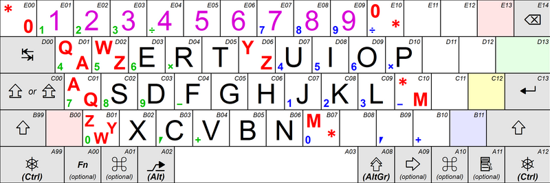

# eomacs: Adapting Emacs for Esperanto (eo)

##  e8: A Quail package for inputting Esperanto and more
This is a combination of 2 input metods:

1. A direct method to input Esperanto letters; e.g. a `QWERTYUIOP[]`
   keyboard is given the `ŜŬERTĜUIOPĴĤ` layout. (This method is also
   applicable to many other layouts as explained below.)
2. An input method for many other characters using their [TeX](https://en.wikipedia.org/wiki/TeX)-ish names
   or [Compose sequences](https://en.wikipedia.org/wiki/Compose_key) in the X System of Unix.

The historic name “e8” is a combination of “Esperanto” (e) and the encoding “UTF-8” (8).
In the Emacs’ mode-line it is marked as **ŭ8** (**U**TF-**8** with a bowl ‹˘›
over **u** reminiscent of an Esperantic diacritic).

In both cases semicolon (;) is used as a prefix modifyer. If the
characters folllowing a semicolon do not form a symbol name defined in
this `e8` method, then the semicolon and the following string are
inputted “as is”; in particular, ‘`; SPC`’ is “semicolon followed by a
space”; so that a reliable method to input a semicolon (even before a
string which coincides with an ``e8`` symbol name) is to type ‘`; SPC BackSpace`’.

### The Direct Method
For definiteness assume that we are using a common US QWERTY keyboard.

There are 6 supersigned Esperantic letters missing in the English
alphabet; there are 4 free English letters (QWXY) which are not used
in Esperanto and thus can be taken for its extra letters; but 2
remainig letters have to be taken from the variant zone, and the most
natural candidates are the keys `D11` and `D12`, according to the
numeration of [ISO/IEC 9995-2:2009](https://en.wikipedia.org/wiki/ISO/IEC_9995)[^1]—



In the US keyboard these are `[`∖`{` and `}`∖`]`. I use the following map:

| Ĉ ĉ | Ĝ ĝ | Ĥ ĥ | Ĵ ĵ | Ŝ ŝ | Ŭ ŭ | ʼ |
| :-: | :-: | :-: | :-: | :-: | :-: |:-:|  
| `X x` | `Y y` | `} ]` | `{ [` | `Q q` | `W w` | <code>;\`</code> |

The *letter apostrophe* U+02BC (ʼ) is listed here, because in Esperanto
it must be considered as a word constituent — see my article *[Pri
apostrofoj kaj citiloj en Esperanto](https://lingvakritiko.com/2024/04/01/pri-la-apostrofoj-kaj-citiloj-en-esperanto/)* (in Esperanto). For pracical
reason also the *single comma quotation mark* U+2019 (’) is made
available as `;,`.

The Quail method maps character to character, not key to character.
E.g. the **B01** key, which produces W in ASERTY, Y in QWERTZ (and Z in
QWERTY), is mapped from these layouts to Ŭ, Ĵ (and Z), respectively.

In other words, in order to input\
   `eĥoŝanĝo ĉiuĵaŭde`   one should press the keys corresponding to\
   `e]oqanyo xiu[awde`   in the original layout.

Conversely, in order to input `quick brown fox` from e8 mode one can use
semicolons:\
   `;quick bro;wn fo;x,`
or simply toggle off the e8 mode with ``C‑\``. (Besides, instead of
semicolon you can use `C‑q` to get the original, crude value of the next key
you press thereafter: `C‑q w` ⇒ `w`, and not `ŭ`.)

### The TeX/Compose Part

Originally for the input of the extra characters **e8** relied on the TeX
definitions from `unicode-input.el` by Florian Weimer; presently these
are being gradually replaced with the shorter and internationally more
intuitive Compose sequences (e.g. `;->` instead of `;rightarrow`). The
Compose sequences have the advantage of being usable in the
applications other than Emacs; OTOH Emacs (and hence e8) is available
on MS Windows and many other non-Unix systems.

## Installation

Put `e8.el` somewhere into the `quail` hierarchy, e.g.\
`site-lisp/quail/`

Add this to your `.emacs` or other initialization file:
```lang-lisp
(register-input-method
 "e8" "utf-8" 'quail-use-package
 "ŭ8" "A direct method to input Esperanto letters"
 "e8")
```
After this piece is evaluated, you can\
`(set-input-method 'e8)`
from a script or interactivly via `C-x RET C-\`.

Afterwards you can switch to another input method in a similar way, or
`toggle-input-method` (``C‑\``) to disable or enable a multilingual text input
method for the current buffer.


[^1]: This image (CC BY-SA by [Karl432](https://commons.wikimedia.org/wiki/User:Karl432)) is taken [from Wikimedia Commons](https://commons.wikimedia.org/wiki/File:Keyboard-alphanumeric-section-ISOIEC-9995-2-2009-with-amd1-2012.png).

